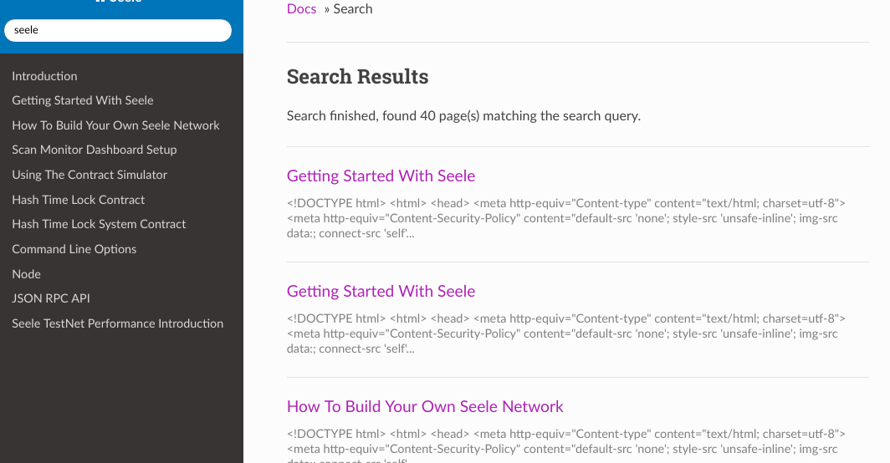
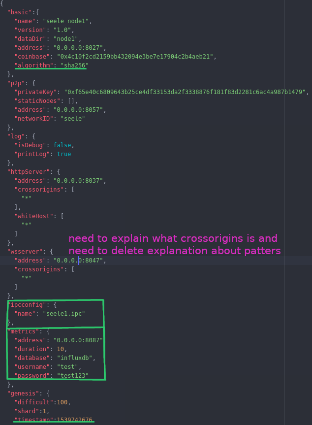
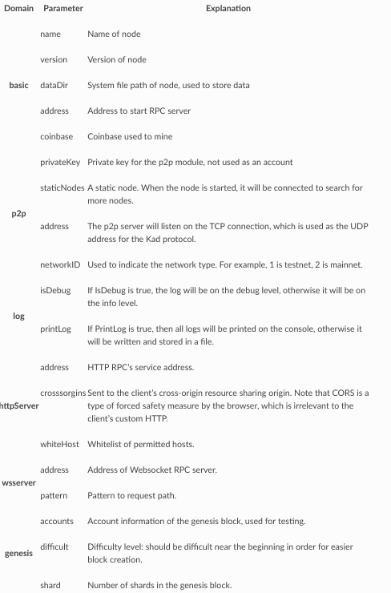

### Issue wiki
  Typing "seele" in the search box would return unrendered html files as shown
  

### Issue wiki
  The explanation on [Setting Up a Node](https://seeleteam.github.io/seele-doc/docs/Getting-Started-With-Seele.html#setting-up-a-node) doesn't match our actual json information
  
  
