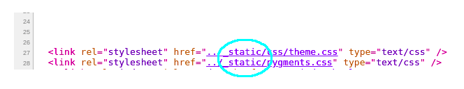

### Issue wiki
   The css file on our [go-seele wiki introduction](https://seeleteam.github.io/seele-doc/introduction/index.html) doesn't work due to this misname of folder in html source code. Change the folder name "_static" into "static"
  
